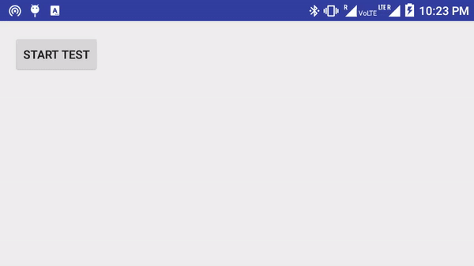
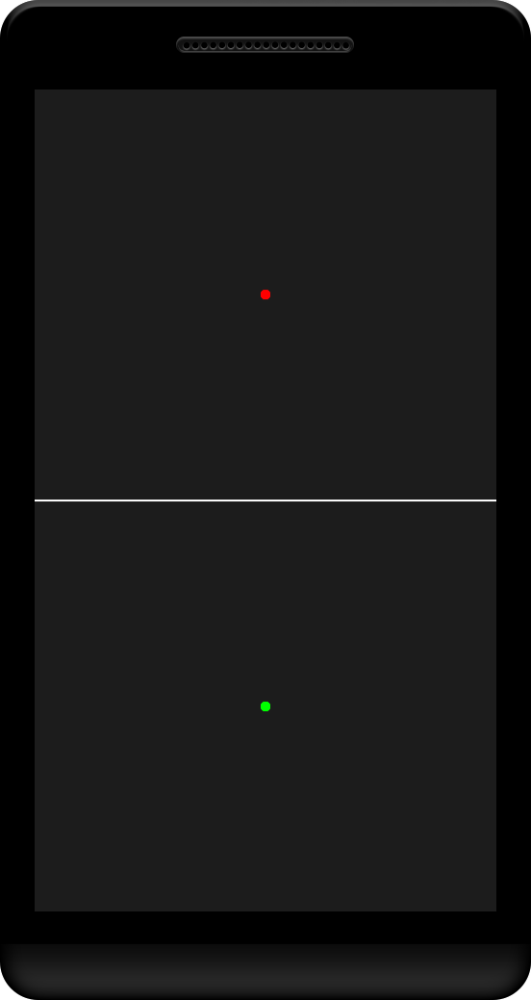
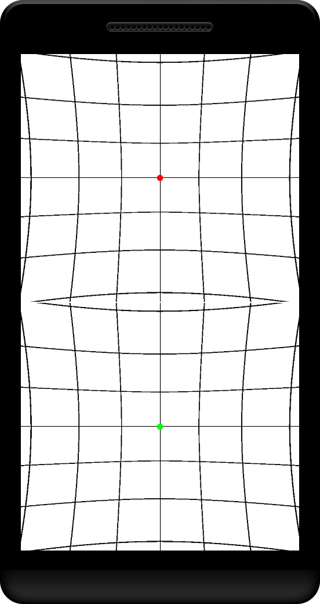
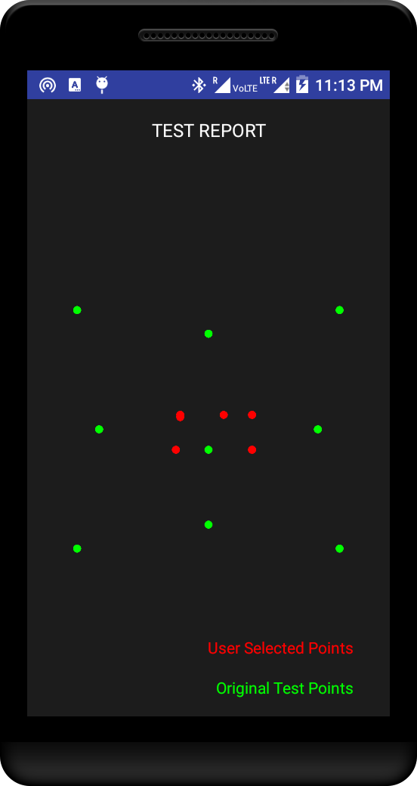

# HessRecordingTest
This is a VR based testing device for diplopia. The application uses a bluetooth joystick to 
connect with the mobile and then control the location of the red point
to make it seem that the both the points overlap with each other when the mobile is worn in a VR device.

# Demo of the application

</img>

# Screenshots
</img> </img> </img> 

</img>

# Download
The application can be checked out [here](https://drive.google.com/open?id=0B_KFChxLPJ41X3JWMzg0YkNKSmc).
